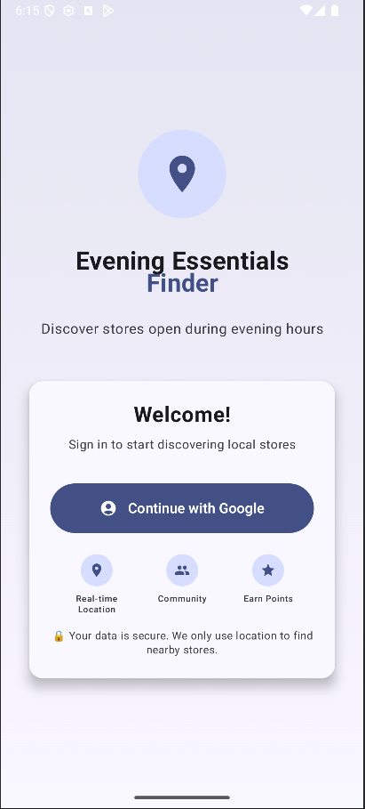
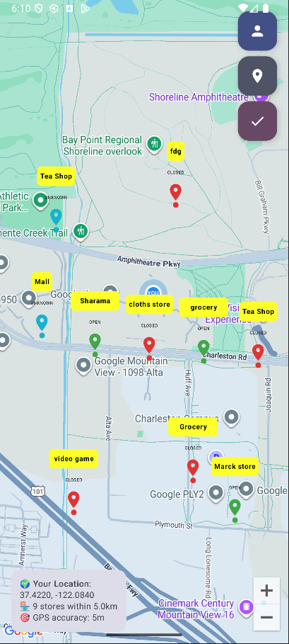
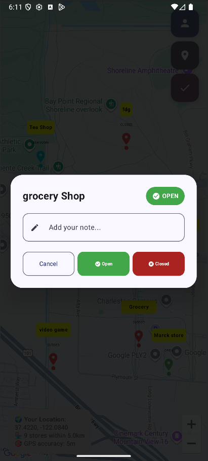
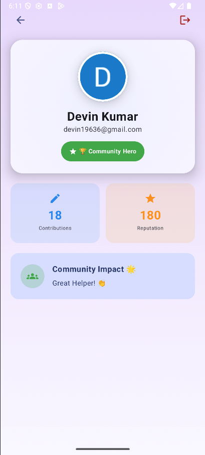

# 🌆 Evening Essentials Finder (KiranaFinder)

<div align="center"> 
  

  

  **A modern, community-driven Android app built with cutting-edge technologies**
</div>

---

## 📱 Download & Install

<div align="center">
Evening Essentials Finder v1.0.0
</div>

### 🚀 Quick Install
1. **Download APK** – Click the button above  
2. **Enable Unknown Sources** – `Settings → Security → Unknown Sources`  
3. **Install** – Open downloaded file and follow prompts  
4. **Grant Permissions** – Allow location access for full functionality  

---

## 🚀 About Evening Essentials Finder
Evening Essentials Finder is a community-driven mobile application that revolutionizes how people discover local essential stores during evening hours. Built with modern Android development practices, this app combines real-time location services, interactive mapping, and community contributions to create a valuable platform for urban communities worldwide.

---

## 🌟 The Problem We Solve
- ❌ Evening shopping challenges: Finding open stores after work hours is often difficult  
- ❌ Unreliable store information: Outdated business hours and availability data online  
- ❌ Community knowledge gap: Local insights about store availability aren't effectively shared  

---

## 🎯 Our Solution
A **real-time, community-verified platform** where users can discover, verify, and share information about evening store availability while earning reputation points for their contributions.  

---

## ✨ Key Features

<div align="center">

🔐 Authentication | 🌍 Global Location | 🗺️ Interactive Maps | 👥 Community  
Google Sign-In | Real-time GPS | Custom Markers | User Contributions  
Session Management | Worldwide Support | Radius Filtering | Reputation System  
Auto Login | Location Accuracy | Live Updates | Store Verification  

</div>

---

## 🎮 Core Functionality

### 🔐 Secure Authentication
- Google Sign-In with Firebase Authentication  
- Automatic session management  
- User profile tracking with contribution statistics  

### 🌍 Global Location Services
- Real-time GPS positioning  
- Automatic detection with smooth camera animations  
- Permission handling with fallbacks  
- Location accuracy display  

### 🗺️ Interactive Mapping
- Google Maps + Jetpack Compose  
- Custom markers with status indicators  
- Radius filtering (1–10km)  
- Long press to add store locations  
- Real-time status updates  

### 👥 Community Features
- Add new stores with details  
- Update store status (Open/Closed/Temporarily Closed)  
- Add helpful notes  
- Reputation system with points  
- Community validation  

### 🎮 Gamification System
- Contribution tracking  
- Reputation points (5–15 per action)  
- User statistics & recognition  

---

## 🏗️ Technical Architecture


<div align="left">

<pre><code>
Evening Essentials Finder
├── 🎨 Presentation Layer
│   ├── Jetpack Compose UI
│   ├── ViewModels (MVVM)
│   └── Navigation Component
├── 🏛️ Domain Layer
│   ├── Use Cases
│   ├── Models
│   └── Repository Interfaces
└── 💾 Data Layer
    ├── Firebase Authentication
    ├── Cloud Firestore
    ├── Location Services
    └── Repository Implementations
</code></pre>

</div>


---

## 🔧 Technology Stack

**Frontend**  
- Jetpack Compose (Material 3)  
- MVVM + Clean Architecture  
- Jetpack Navigation Compose  
- StateFlow + Compose State  

**Backend & Services**  
- Firebase Auth + Google Sign-In  
- Firestore (real-time database)  
- Google Maps SDK  
- Fused Location Provider API  
- Hilt for Dependency Injection  

**Development**  
- Kotlin (100%)  
- Coroutines + Flow  
- Gradle Version Catalogs  
- Repository Pattern + Use Cases  

---

## 📱 Screenshots


<div align="center">

<table>
  <tr>
    <td align="center">
      🔐 Authentication <br/>
      
    </td>
    <td align="center">
      🗺️ Map View <br/>
      
    </td>
    <td align="center">
      🏪 Store Details <br/>
      
    </td>
    <td align="center">
      👤 Profile <br/>
      
    </td>
  </tr>
</table>

</div>


---

## 🛠️ Getting Started

### Prerequisites
- Android Studio Flamingo or later  
- Android SDK 24+ (Android 7.0+)  
- Firebase project with Authentication & Firestore  
- Google Maps API key enabled  
# 🌆 Evening Essentials Finder


Find nearby evening essentials (grocery, food, pharmacy, etc.) with a clean, modern Android app built with **Jetpack Compose, Firebase, and Google Maps API**.  

---

## 🚀 Installation Steps

```bash
# Clone the repository
git clone https://github.com/yourusername/evening-essentials-finder.git
cd evening-essentials-finder

# Build & Run
./gradlew assembleDebug

```

## 📊 Project Structure

<div align="left">

 <pre><code>
app/src/main/java/com/example678/kiranafinder2/
├── 🎨 presentation/
│   ├── ui/ (auth, map, profile, component)
│   └── viewmodel/
├── 🏛️ domain/
│   ├── model/
│   ├── repository/
│   └── usecase/
└── 💾 data/
    └── repository/
  </code></pre>

</div>

## 📋 Installation Requirements

   - Android 7.0+

   - 2GB RAM (4GB recommended)

   - 50MB free space

   - Internet & GPS access

## 🔒 Security & Privacy

   - APK signed with official cert

   - No unauthorized data collection

   - Location used only for maps

   - Open-source & auditable

## 🚧 Roadmap

   - Phase 1: Photo uploads, ratings, advanced search, offline mode

   - Phase 2: Store owner integration, business hours updates, promotions

   - Phase 3: Multi-language, PWA, APIs, leaderboards

## 🤝 Contributing

We welcome contributions!

   - Fork & clone repo

   - Create feature branch:

   - git checkout -b feature/amazing-feature

   - Make changes, test, commit, push

   - Open Pull Request

   - Follow Kotlin Coding Conventions

## 📈 Performance

  -  Cold start < 2s

  -  Map load < 1s

  -  Memory < 100MB

  -  Accuracy: 5–10m GPS

## 🆘 Support & FAQ

Q: Why location permission?
A: Required for map & nearby stores.

Q: Can I use without login?
A: Google Sign-In required to contribute.

Q: Offline support?
A: Planned for future release.


🙏 Acknowledgments

   - Google (Android APIs & Maps)

   - Firebase team

   - Jetpack Compose community

   - Open-source contributors

   - Local communities


<div align="center">

🌟 Star this project if you found it helpful!
Built with ❤️ for communities worldwide

</div> ``
